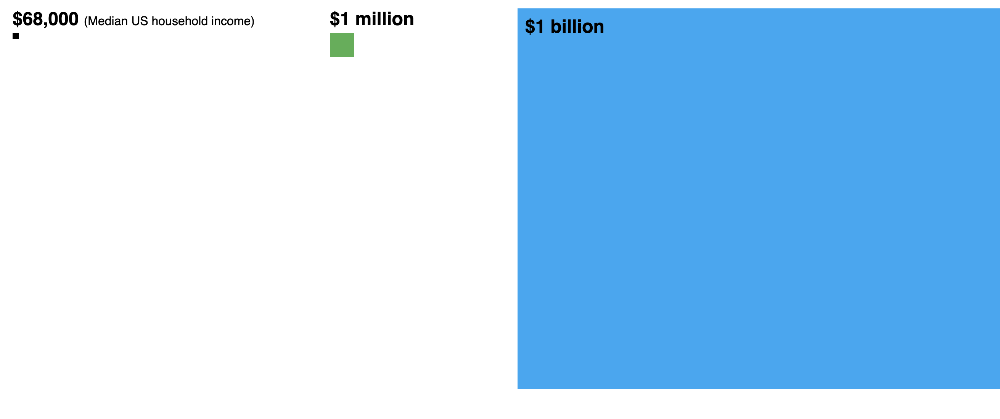
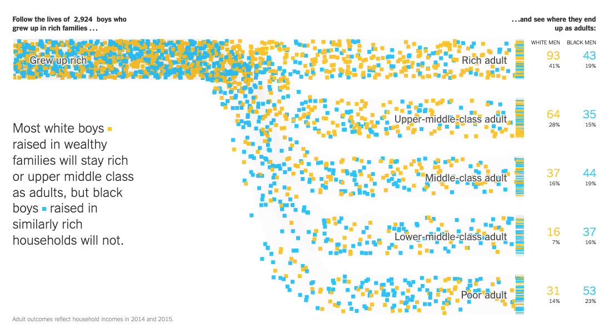
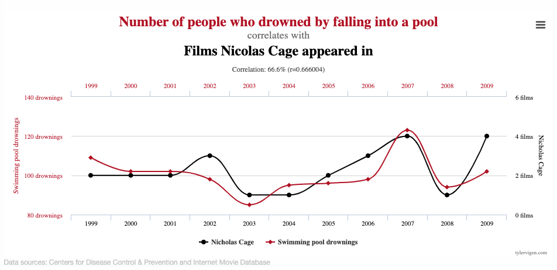

# Data Visualization

Alice McGrath | 25 February 2025

# Overview

1. Discussion of the readings
2. Reviewing examples
3. What makes a good data viz?

# Readings & discussion

# [Data X Design](https://dataxdesign.io/chapters/intro)

<small>Visualzations by [William Playfair](https://en.wikipedia.org/wiki/William_Playfair) (left) and [Shanawdithit](https://en.wikipedia.org/wiki/Shanawdithit) (right), from Data x Design, Introduction</small>

## "Introduction: A Counterhistory of Data Visulization"

- What is important about the visual & digital form of this chapter?
- Why does it matter which examples we use to tell the history of data visualization?

# Data Humanism

Giorgia Lupi: ["The Revolution will be Visualized"](https://giorgialupi.com/data-humanism-my-manifesto-for-a-new-data-wold)

[Data Humanism, a visual manifesto](https://giorgialupi.com/data-humanism-my-manifesto-for-a-new-data-wold), by Giorgia Lupi

## What makes data "human"?

What about "humanistic"?

# Visualization examples

# Ex. 1 [Warming Stripes](https://bpb-eu-w2.wpmucdn.com/blogs.reading.ac.uk/dist/3/187/files/2018/05/globalcore.png)

<small>Ed Hawkins, University of Reading, 2018. See also this [interactive version here](https://showyourstripes.info/s/globe) or read more about its [growing influence](https://nightingaledvs.com/making-the-growing-influence-of-the-warming-stripes/)</small>

---

- What's the message of this viz?
- Why is this effective?

# Ex. 2: Wealth, shown to scale

<small>Matt Korostoff (2021); NB: the original version ([MKorostoff/1-pixel-wealth](https://github.com/MKorostoff/1-pixel-wealth)) is no longer available, this adaptation by Omar A. Douglass is pretty close: [Wealth To Scale, adapted for classroom](https://oadouglas.github.io/Wealth-To-Scale-Adapted-For-Classroom/). Various other 
[translations and adaptations are available here](https://github.com/ave-uhhh/billionaires_to_scale?tab=readme-ov-file).</small>

# Ex. 3: [Dunham's Data](https://visualizations.dunhamsdata.org/1947-60personnelflow/) 
[Interactive Flow of Katherine Dunham's Dancers, Drummers, and Singers (2019)](https://dunhamsdata.org/portfolio/visualizations/interactive-flow-katherine-dunhams-dancers-drummers-and-singers-check-ins)

- Read about the Dunham's Data project: [dunhamsdata.org](https://dunhamsdata.org/)

- See also: ["Visceral Data for Dance Histories: Katherine Dunham's People, Places, and Pieces"](https://www.cambridge.org/core/journals/the-drama-review/article/visceral-data-for-dance-histories/72623D4392C448812C21E3EFDDC9FC69), Harmony Bench and Kate Elswit, *The Drama Review* 66.1 (March 2022)

# Ex. 4: Reach of Racism

<small>NY Times: [Extensive Data Shows Punishing Reach of Racism for Black Boys](https://www.nytimes.com/interactive/2018/03/19/upshot/race-class-white-and-black-men.html?mtrref=search.brave.com&assetType=PAYWALL) (3/19/2018)</small>

---

- NB: url is paywalled - [see access instructions here](https://guides.tricolib.brynmawr.edu/nytimes-BMC).
- See also: more info about the [study by Opportunity Insights that developed the data](https://opportunityinsights.org/paper-category/race/)

# W.E.B. Du Bois: Data Portraits

<small>Chart from Du Bois's 1900 "The Exhibition of American Negroes," featured in [Data by Design ch. 5](https://dataxdesign.io/chapters/dubois)</small>

## See also

- Library of Congress: [Charts and graphs showing the condition of African Americans at the turn of the century exhibited at the Paris Expositions Universelle in 1900](https://www.loc.gov/pictures/item/2005679642/) 
- Blog post about the exposition by Ellen Terrell: ["Du Bois in Paris"](https://blogs.loc.gov/inside_adams/2015/02/du-bois-in-paris-exposition-universelle-1900/)

- Rusert and Battle-Baptiste, *W.E.B. Du Bois's data portraits: visualizing Black America* (Princeton Architectural Press, 2018) 
- The [Du Bois Data Portrait Challenge](https://www.kaggle.com/datasets/paultimothymooney/dubois-data-portrait-challenge), an effort to recreate these visualizations using contemporary tools
- See also [the data on their github repository](https://github.com/ajstarks/dubois-data-portraits/tree/master/challenge)

# Other examples

- Physicalizations and Visualizations from the "Energy Afterlives" 360: in Dalton Hall and [on the Scalar site](https://jvergara.digital.brynmawr.edu/scalarexhibitions/con/coil-oil-nuclear-energy-extraction/data-physicalizations-and-visualizations-1)

- [The Shape of Dreams (Google Trends)](https://the-shape-of-dreams.com/#/), Federica Fragapane, 2020.
  - Medium post: [Visualizing the Shape of Dreams](https://medium.com/@frcfr/visualizing-the-shape-of-dreams-for-google-trends-5164c3c4e382)

# Questions to ask

- How does it affect you? Why?
- What message is it trying to communicate?
- What questions does it raise?

# What makes a good data viz?

# Inspiration

- For choosing visualizations: [From Data to Viz](https://www.data-to-viz.com/)
- [Dear Data project](http://www.dear-data.com/theproject), Georgia Lupi & Stefanie Posavec
- Winners of the [Information is Beautiful Awards](https://www.informationisbeautifulawards.com/)
- Use your imagination! Draw your visualization on paper.

# Correlation is not causation

See other [Spurious Correlations](https://www.tylervigen.com/spurious-correlations), by Tyler Vigen.

---

[Return to wk 6](https://atmcgrath.github.io/intro-dh/wk/06.html)