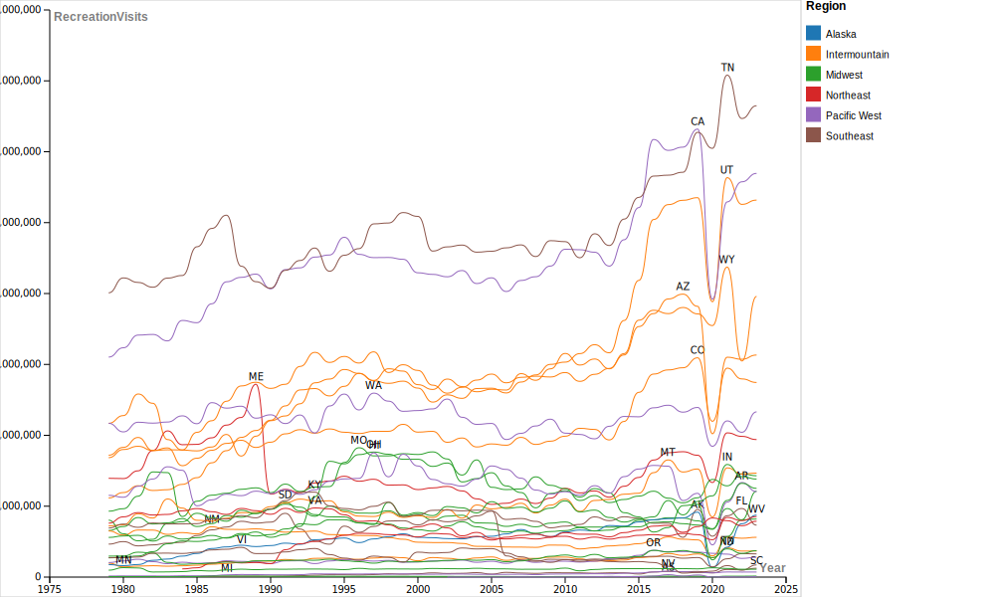

## Agenda

1. Data visualization workflow
2. Activity using RawGraphs
3. On your own

---

## How do you make a data viz?

---

---

### Get data

- Collect it
- Find a dataset
- Clean and organize it
- Get to know the context and effects of the data collection process

---

### Analyze data

<section>

- What types of data do you have?
- How many variables do you have? How do your variables relate to each other? 
- What questions can your dataset answer? What stories can it tell?

</section>
<section>

#### What types of data do you have? 

Numeric | categoric | geographic | temporal |relationships

</section>
<section>

#### How many variables do you have? How do your variables relate to each other? 

quantities/distribution | correlation | part of a whole | change over time | connections

</section>
<section>

#### What questions can you answer?

#### What stories can you tell?
</section>
---

## Design visualizations

<section>

### What will you show? 

- All variables? Relationships between variables? 
- Summaries? Every data point?

</section>
<section>

### What graph types would be most effective?

- Useful resource: [From Data to Viz](https://www.data-to-viz.com/)
- Use your imagination! Draw your visualization on paper.

</section>
<section>

### Communication

- What methods can you use to highlight your variables?
- How can you make the results visually compelling and engaging?
- How can you make them more accessible?

</section>
<section>

### Storytelling

- What should viewers take away from your visualization?
- What kind of contextual information is needed for them to understand it?

</section>

--- 

## Data Viz with RawGraphs

<small>Visitors to US National Parks by year, 1979-2023</small>

---

## Getting started

- Download the data here: [National parks annual data](https://raw.githubusercontent.com/melaniewalsh/responsible-datasets-in-context/main/datasets/national-parks/US-National-Parks_RecreationVisits_1979-2023.csv) 
- Save it to a folder on your computer that you'll be able to find later
- Upload the dataset to [WTF CSV](https://databasic.io/en/wtfcsv/) to see some basic info about it
- What types of data do we have?

---

## V1: RawGraphs line graph

<section>

- Navigate to [RawGraphs.io](https://www.rawgraphs.io/)
- Click 'Use it Now'
- Upload the parks dataset
- Make sure the data in each row is categorized correctly
- Scroll down to 'Choose a Chart' and select 'Line Chart'
- Drag 'Year' onto the X axis
- Drag 'RecreationVisits' onto the Y axis

</section>
<section>

- Look at the result. What do you notice?
- Now drag 'ParkName' onto 'Lines'
- Try dragging things onto 'Color' and 'Series' and try swapping out other categories for 'Lines'
- When you have something you are satisfied with, scroll down to 'export'. Choose either `.svg` or `.png`
- Save this in the same folder as your csv.

</section>

---

## On your own

<section>

- In pairs, create 2-3 other graphs to show different things with the original dataset or a stacked dataset. 
- Save 2 graphs and post them to the Moodle Forum for today

</section>

<section>

- Tips
  - Use the [RawGraphs documentation](https://www.rawgraphs.io/learning) for more detail on particular charts.
  - Create at least one graph that shows hierarchies.
- Optional: try out [Park visits by month](https://raw.githubusercontent.com/melaniewalsh/responsible-datasets-in-context/main/datasets/national-parks/US-National-Parks_Use_1979-2023_By-Month.csv), which also includes data on camping and other categories.
  
</section>

---

## V3: Draw your data

- In your pairs, draw visual representations of the National Parks data using paper and markers
- Design them however you like
- Aim to create two different versions

---

## Discussion

::: incremental

- Share out your visualizations and explain your vision.
- What did you find interesting or difficult about this process?
- What context or additional data would you want to bring in if you were building a data story or data essay?

:::

---

## Resources

